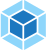

# Hi 👋, I'm Andrei
  Nice to meet you)

## A passionate **W**eb **D**eveloper
  
- 👨‍💻 Work at Peninsula UK
- 📫 Send me an email costivandrei@gmail.com
- My  [costiv-andrei](https://www.linkedin.com/in/andrei-costiv/)

<h3 align="left">Languages and Tools:</h3>

     
     
     
    
     
     
     
     
     
     
    
     
    
     
    
     
     
     
     
     
    <!--   -->
       
     
     

